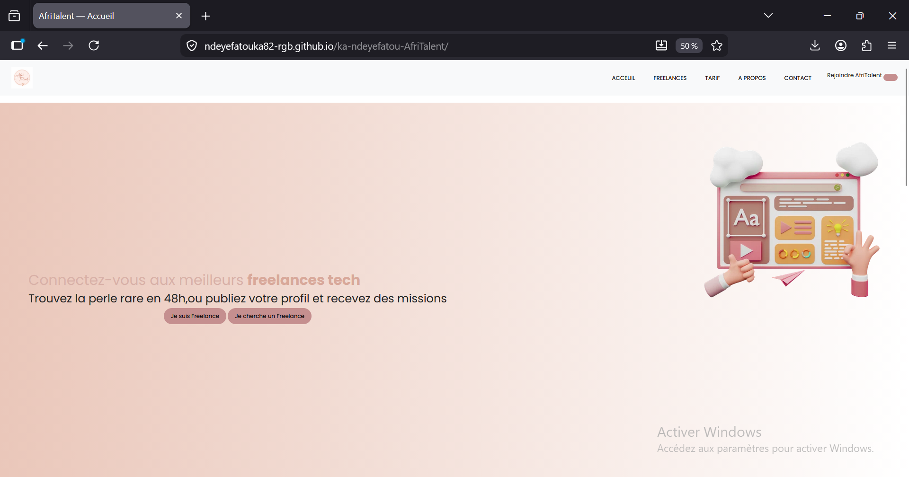

# AfriTalent
Projet fil rouge — Plateforme de mise en relation entre freelances africains et
clients.
Auteur : Ndeye Fatou Ka 
Promotion : L1 Web — ISI

## Lien du site :[AfriTalent] (https://ndeyefatouka82-rgb.github.io/ka-ndeyefatou-AfriTalent/)
## Technologies
- boostrap
- html
- css
- java script
# appercus du site

## description
AfriTalent est une plateforme freelance qui connecte les talents africains avec des opportunités à travers le monde. 
## Fonctionnalites
- Navigation entre les différentes pages (Accueil, Freelances, Tarifs, À propos, Contact).
- Affichage des profils de freelances.
- Filtrage des freelances par catégorie.
- Mode sombre (Dark Mode) avec sauvegarde du thème grâce à localStorage.
- Formulaire de contact avec validation en JavaScript.
- Navbar dynamique au défilement de la page.
- Animations et effets visuels pour améliorer l'expérience utilisateur.
- Site responsive adapté aux mobiles, tablettes et ordinateurs.
- Déploiement du site avec GitHub Pages.